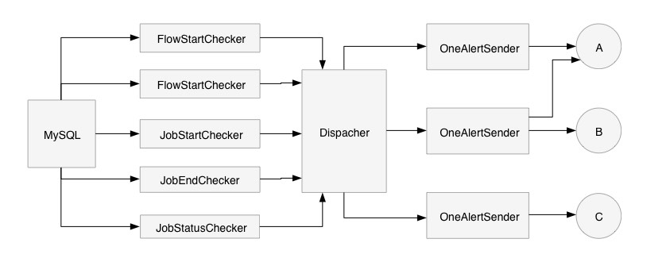

# azkaban-monitor
azkaban 监控小程序。

---

## 简介
通过对azkaban元数据(mysql)的定期扫描，过滤出满足指定状态的记录，并将其将记录通过 OneAlert 进行告警。

## 组件
* checker  
分为对应 FlowStart/FlowEnd/JobStart/JobEnd/JobStatus 共计5种。  
分别扫描作业/流是否在指定时间(HH:mm)完成/结束，是否处于指定状态(failed/killed)。
* dispacher
接收各checker发送过来的告警事件，并将事件发送给sender。
* sender
接收告警事件，并触发告警。
目前实现的sender为 OneAlertSender 。
可配置多个sender，并为每个sender配置生效时间。

## 架构图


## 使用
1. 编译
    ```text
    mvn clean package -Dmaven.test.skip=true
    ```
2. 部署
    ```text
    cp target/azkaban-monitor-1.0-SNAPSHOT-bin.tar.gz path/to/deploy/
    cd path/to/deploy/
    tar zxvf azkaban-monitor-1.0-SNAPSHOT-bin.tar.gz
    ```
3. 准备依赖
    - zookeeper  
    程序zookeeper进行心跳上报，上报信息包括当前正在运行的监控程序 主机:ip 最后心跳时间 。
    可以通过zookeeper避免程序，并可以通过status命令检查当前已启动监控程序的心跳信息。
    - OneAlert  
    sender实现依赖 OneAlert，需要提前在 OneAlert 配置 REST_API 应用，并记录 AppKey。
4. 修改配置
    修改 azkaban-monitor.xml 配置文件。
    ```text
    <configuration>
        <zookeeper>
            <quorum>test01:2181</quorum>  <!-- zookeeper的节点地址。 -->
            <node>/monitor</node>  <!-- 使用zookeeper的节点目录。 -->
            <timeout>90000</timeout>  <!-- 连接zookeeper的超时时间。 -->
        </zookeeper>
        <monitor>
            <heartbeat>
                <interval>30000</interval>  <!-- # 心跳上报间隔。同时也是每次进行状态检查的间隔。 -->
            </heartbeat>
        </monitor>
        <database>
            <driver>com.mysql.jdbc.Driver</driver>  <!-- azkaban元数据库driver，默认为mysql。 -->
            <url>jdbc:mysql://test03:3306/azkaban</url>  <!-- 元数据jdbc地址。 -->
            <user>azkaban</user>
            <password>azkaban</password>
        </database>
        <conditions>  <!-- 可配置多个条件，每个条件都会进行一次检查。 -->
            <!--
            <template>
                # project，flow，job底层由mysql查询like关键字实现。
                # 如检查级别是job，那么project，flow，job均不能为空。
                # 如检查级别是flow，那么job字段必须为空。
                <project>%</project>
                <flow>%</flow>
                <job>%</job>
                # 状态表
                #    10>Ready
                #    20>Preparing
                #    30>Running
                #    40>Paused
                #    50>Succeed
                #    55>Killing
                #    60>Killed
                #    70>Failed
                #    80>Failed Finishing
                #    90>Skipped
                #    100>Disabled
                #    110>Queued
                #    120>Failed, treated as success
                #    125>Cancelled
                # 请用逗号隔开，如不配置，则表示不检测。
                <status>60,70</status>
                # attempt大于等于多少次后触发。
                <attempt>1</attempt>
                # 匹配sender，不配置或空值，表示全匹配。
                <sender/>
            </template>
            -->
            <allfailed>  <!-- 检查所有失败状态的job。 -->
                <project>%</project>
                <flow>%</flow>
                <job>%</job>
                <status>70,80</status>
                <attempt>1</attempt>
            </allfailed>
            <flow1>  <!-- 检查 test项目 的 ttt流 是否在 17:30 启动，是否在 18:30 停止。 -->
                <project>test</project>
                <flow>ttt</flow>
                <starttime>17:30</starttime>
                <endtime>18:30</endtime>
            </flow1>
            <job2> <!-- 检查 test项目 tt2流 的 -->
                <project>test</project>
                <flow>tt2</flow>
                <starttime>17:28</starttime>
                <endtime>17:28</endtime>
            </job2>
        </conditions>
        <senders>  <!-- 可配置多个sender，为每个sender配置不同的生效时间来间接实现排班功能。 -->
            <sa>  <!-- 在每周二、四、六、日的凌晨0点到6点，告警发送至onealert的ccc应用。 -->
                <app>ccc</app>  <!-- onealert集成应用的 AppKey -->
                <week>2,4,6,7</week>  <!-- 在每周的周几生效。 -->
                <hour>0-6</hour>  <!-- 在每天的几点生效。 -->
            </sa>
            <sb>
                <app>cba</app>
                <week>1,3,5</week>
                <hour>0-6</hour>
            </sb>
            <sc>
                <app>abc</app>
                <week>1,3,4,5</week>
                <hour>0-23</hour>
            </sc>
        </senders>
    </configuration>
    ```
5. 启停
    执行 bin/monitor.sh 脚本。
    ```text
    bin/monitor.sh start # 启动监控程序。
    bin/monitor.sh status # 检查当前运行的监控程序主机:ip与最后一次心跳时间。
    bin/monitor.sh stop # 停止监控程序。
    ```
6. 日志查看 
    ```text 
    logs/azkaban-monitor.log
    ```
